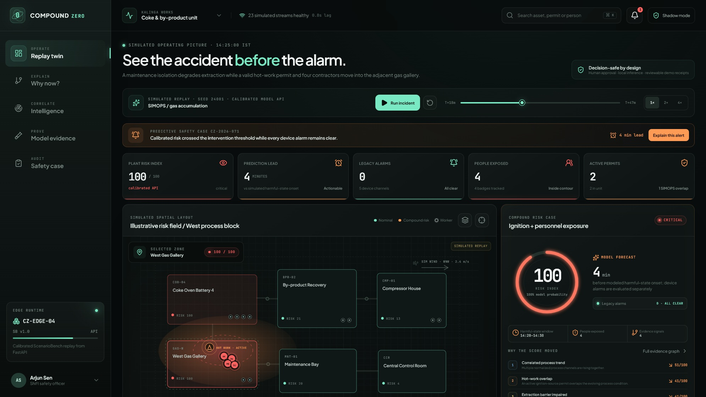
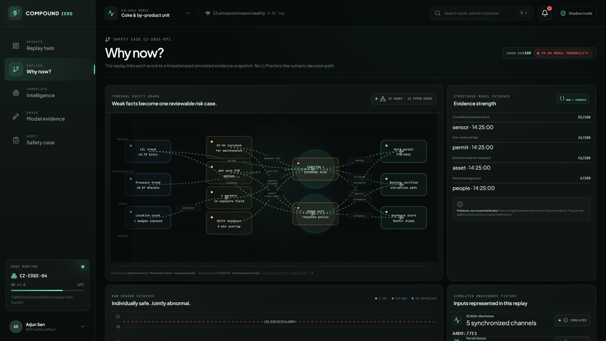
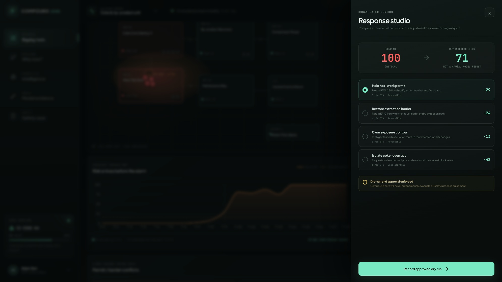
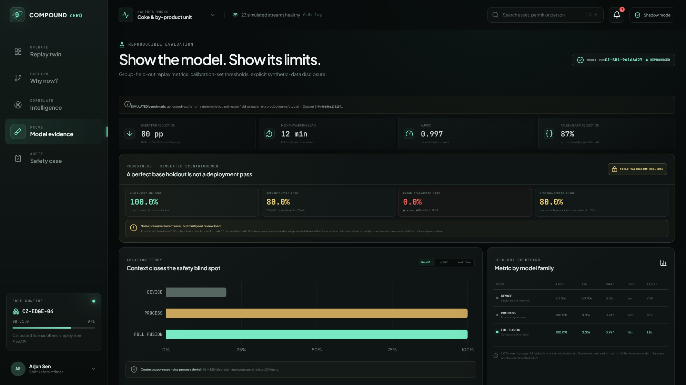
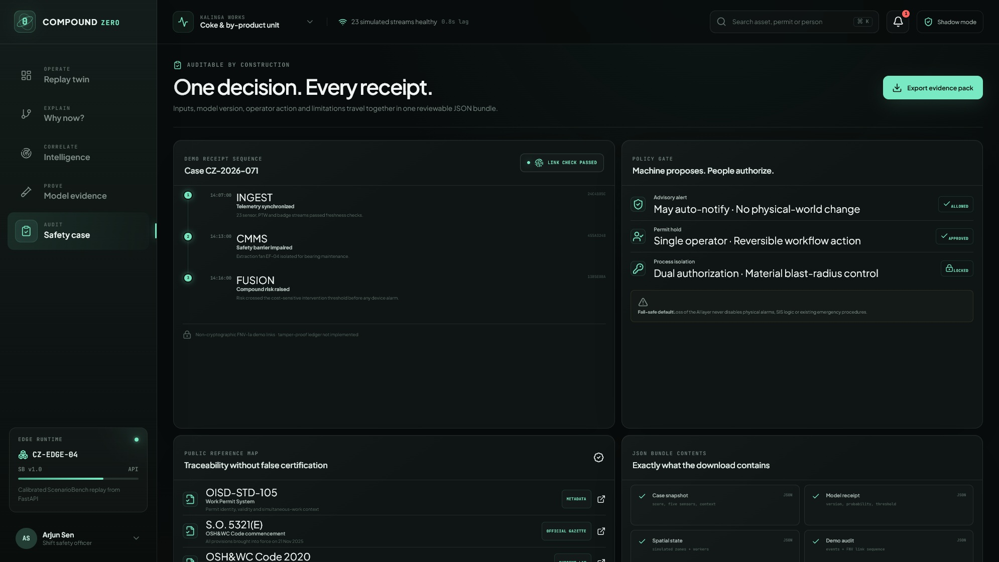
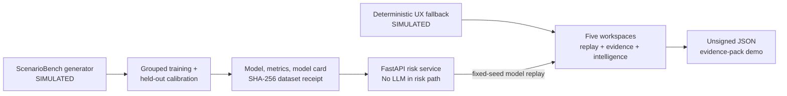

# Compound Zero

> **See the accident before the alarm.**

Compound Zero is an industrial-safety intelligence prototype for **PS1 — AI-Powered Industrial Safety Intelligence for Zero-Harm Operations**. It detects dangerous combinations that can remain invisible to independent alarms: a weak gas trend, an impaired extraction barrier, an active hot-work permit, and people entering the same exposure zone.

The product is deliberately not a safety chatbot. Its risk path is a deterministic feature pipeline plus a calibrated scikit-learn model. The interface explains the evidence, lets an operator compare counterfactual controls, and records the dry-run decision. No language model authorizes a safety action.

<p align="center">
  <a href="submission/assets/command-t18.png">
    
  </a>
</p>
<p align="center"><sub><strong>Critical replay state:</strong> fused risk 100, four people exposed, four minutes of simulated lead, and zero legacy device alarms.</sub></p>

## Product walkthrough

The five operator workspaces move from detection to explanation, bounded human response, reproducible evidence and an auditable decision record.

| Causal evidence — weak signals become one reviewable case | Human-gated response — compare controls without actuating equipment |
|:---:|:---:|
| <a href="submission/assets/evidence-t18.png"></a> | <a href="submission/assets/response-studio.png"></a> |
| **Robustness evidence — the diagnostic failure is published, not hidden** | **Auditable safety case — model, inputs, policy gate and receipts travel together** |
| <a href="submission/assets/validation.png"></a> | <a href="submission/assets/safety-case-top.png"></a> |

## What is in this repository

| Layer | Implemented now | Evidence |
|---|---|---|
| Interactive command centre | Deterministic 48-minute replay, plant risk map, workers, permits, sensor traces, risk history, response studio | `apps/web` |
| Explainability | Typed evidence graph, ranked factors, raw traces, provenance display | `apps/web/src/pages/EvidenceView.tsx` |
| Evaluation | Reproducible simulated benchmark, whole-seed train/calibration/test split, three-model ablation, scenario-type holdouts and fixed-model stress tests | `data/scenario_bench`, `ml`, `artifacts/metrics.json`, `artifacts/robustness_metrics.json` |
| Risk API | Health, model metadata, benchmark metrics, typed scoring, scenario catalogue and deterministic replay | `services/api` |
| Privacy-preserving vision context | Metadata-only CCTV observation contract; rejects raw media, biometrics and identity tracking; fuses recent in-zone counts/distance/confidence into the same model | `services/api/vision_context.py` |
| Incident pattern retrieval | Deterministic BM25 search over five project-authored, source-attributed reference patterns; no generative model | `services/api/knowledge.py`, `data/knowledge` |
| Permit/evidence audit | Deterministic evidence-completeness and conflict checks with cited public reference metadata and SHA-256 evidence-manifest receipt | `services/api/permit_audit.py` |
| Response approvals | Ephemeral plans with action-dependent human roles, immutable terminal state and manual-only/no-actuation contract | `services/api/response_store.py` |
| Safe failure | Input validation, stream-quality abstention, no actuator endpoint, explicit human-gated dry-run controls | `services/api`, `apps/web` |
| Audit demonstration | Timeline and downloadable JSON evidence pack | `apps/web/src/pages/SafetyCaseView.tsx` |

Every bundled scenario and benchmark row is marked **SIMULATED**. This is a prototype evaluation of the compound-risk hypothesis, not field validation, certification, or evidence of production safety performance.

## One-command judge setup (Docker)

With Docker Engine and Compose v2 installed:

```bash
cp .env.example .env  # optional; defaults already work
docker compose up --build --wait
```

Open the command centre at <http://127.0.0.1:4173> and API documentation at <http://127.0.0.1:8000/docs>. The web container proxies `/api` to the backend, so the browser needs no container-network configuration. Verify both services with:

```bash
curl --fail http://127.0.0.1:4173/healthz
curl --fail http://127.0.0.1:4173/api/health
```

Stop the stack with `docker compose down`. Both containers run without added Linux capabilities, with read-only filesystems, bounded temporary storage and health checks. These controls harden the demonstration runtime; they do not convert the prototype into a field safety system.

## The signature demonstration

1. Extraction fan `EF-04` is isolated for maintenance.
2. LEL, H2S, CO, oxygen and pressure move together, while individual device thresholds remain clear.
3. Hot-work permit `PTW-2841` becomes active in the adjacent gas gallery.
4. Four pseudonymous worker markers enter the exposure contour.
5. Compound Zero raises a fused risk case, explains the interacting evidence, and shows the expected lead relative to the configured device-alarm baseline.
6. The operator opens Response Studio, compares non-causal projected risk reductions, and records an approved **dry-run** permit hold, extraction restoration, evacuation, or dual-authorized isolation request. No field action is executed.
7. The action and outcome appear in the prototype audit timeline and exported evidence pack.

On startup, the browser requests the persisted model's deterministic `compound_hot_work` replay for seed `24001`. When the API is available, model probability, risk state, process traces and structured factors come from that replay; the interface visibly identifies the engine as **API**. If the API is unavailable, it switches to an explicitly labelled deterministic **UX fallback**. Worker/permit animation, counterfactual control effects and the evidence-pack demonstration remain client-side simulation in both modes.

## Measured prototype results

The checked-in metrics were produced by `python -m ml.train` from ScenarioBench v1.0.0. Evaluation uses a held-out test partition of **5,616 rows across 13 seeds**; training, probability calibration and testing share no seeds.

| Method | Event recall | Event FNR | Earlier than device in 13 device-alarm groups | Detected in 52 no-device-alarm groups | Median lead | False-alarm episodes / simulated 24 h | Row AP | Brier |
|---|---:|---:|---:|---:|---:|---:|---:|---:|
| Single-sensor threshold | 20.0% | 80.0% | 0.0% | 0.0% | 5 min | 7.50 | 0.813 | 0.242 |
| Process signals only | 100.0% | 0.0% | 100.0% | 100.0% | 12 min | 8.65 | 0.947 | 0.070 |
| **Compound Zero full fusion** | **100.0%** | **0.0%** | **100.0%** | **100.0%** | **12 min** | **1.15** | **0.997** | **0.015** |

The device comparison window ends at authored harmful-state onset. The two subgroups are reported separately so “device never alarmed by onset” is not counted as “model detected earlier.” On this authored simulated test set, full fusion reduces event false-negative rate by **80 percentage points** versus the device baseline and reduces false-alarm episodes by **7.5 per simulated 24 hours** versus the process-only model. Those results establish reproducibility and an ablation signal; they must not be extrapolated to a real facility.

Dataset fingerprint: `96166a2762577a2fa8440e2a6f0f819c342aef9e9cf790e3ed2bef3eb6f4e314`

### Robustness evidence — including the failure we found

The base whole-seed holdout is only one test. `python -m ml.robustness_bench` therefore adds a nine-fold **leave-one-scenario-type-out (LOSO)** protocol: every replay of one scenario family is excluded from model fitting and threshold calibration, then evaluated by a model that has not seen that family. Across the five event-bearing folds, pooled event recall is **256/320 (80.0%)**, not 100%. In particular, the model detects **0/64 held-out `process_drift` events**. That diagnostic failure is published as a deployment blocker, not averaged away.

The same simulated suite freezes the base model and threshold while perturbing its inputs. Removing either the process-sensor stream or the combined barrier-and-shift stream reduces event recall to **52/65 (80.0%)**. Authored Gaussian sensor noise at `σ=0.05` preserves event recall at 65/65 but increases false-alarm episodes from **1.15 to 47.88 per simulated 24 hours**. These perturbations diagnose sensitivity; they are not a production imputation, abstention or fail-safe policy.

All robustness rows remain authored **SIMULATED ScenarioBench evidence**. They do not establish site transfer, field reliability or certification. Before operational use, the unseen-scenario miss and missing-stream sensitivity must be addressed on authorized local history, followed by site calibration, prospective shadow-mode validation, operator review and independent safety approval. The full protocol, fold metrics, stress descriptions and limitations are inspectable in `artifacts/robustness_metrics.json`.

### Geospatial evidence quality

`GeoEvidenceBench` adds a deterministic, boundary-heavy test of fictional plant-local polygons, nearest authored hazard distance and declared localization-error bounds. Across **337 simulated cases**, point-only classification has `0.816` recall; conservative uncertainty-aware review has `1.000` recall and routes ambiguous boundary cases to a person. Its false-positive review rate rises from `0.168` to `0.454`, which is explicitly treated as workload—not hidden as “accuracy.” Certain-exposure precision is `1.000`, nearest-hazard distance MAE is `0.907 m`, and no surveyed coordinate, plume-physics or field-performance claim is made.

### Assumption-led pilot economics

The editable low/base/high sensitivity model deliberately excludes any monetary value for injury, death or a prevented incident. Under its authored assumptions, the conservative case does not pay back; the illustrative base case produces **₹973,875** annual workflow capacity/nuisance-hold exposure, a **25.2-month** simple payback and **1.19** undiscounted three-year benefit-cost ratio; the high row is an upside bound, not a forecast. Every input and limitation is inspectable in `artifacts/pilot_economics.json` and `docs/pilot-economics.md`.

## Quick start on Windows

Prerequisites: Python 3.11+, Node.js, and pnpm 11.x.

```powershell
python -m venv .venv
.\.venv\Scripts\python.exe -m pip install --upgrade pip
.\.venv\Scripts\python.exe -m pip install -e ".[dev]"
pnpm install
```

Start the API in one terminal:

```powershell
.\.venv\Scripts\python.exe -m services.api.run
```

Start the web application in another:

```powershell
pnpm dev
```

Open:

- Web application: <http://127.0.0.1:4173>
- Interactive API documentation: <http://127.0.0.1:8000/docs>
- API health: <http://127.0.0.1:8000/health>

Keyboard shortcuts in the web application: `Space` plays or pauses the replay; `1`–`5` switch between Replay twin, Why now?, Intelligence, Model evidence and Safety case. Replay shortcuts are ignored while focus is on an interactive control.

## Reproduce the benchmark

Regenerate ScenarioBench, the persisted model, metrics and model card:

```powershell
.\.venv\Scripts\python.exe -m ml.train
```

This intentionally rewrites:

- `data/scenario_bench/scenario_bench.csv`
- `data/scenario_bench/metadata.json`
- `artifacts/compound_zero_model.joblib`
- `artifacts/metrics.json`
- `artifacts/model_card.json`

Regenerate the independent robustness, geospatial and pilot-economics evidence artifacts:

```powershell
.\.venv\Scripts\python.exe -m ml.robustness_bench --output artifacts/robustness_metrics.json
.\.venv\Scripts\python.exe -m ml.geospatial_bench --output artifacts/geospatial_metrics.json
.\.venv\Scripts\python.exe -m ml.pilot_economics --output artifacts/pilot_economics.json
```

Run the verification gates:

```powershell
.\.venv\Scripts\python.exe -m pytest -q
pnpm test
pnpm typecheck
pnpm build
```

See [the runbook](docs/runbook.md) for API examples, demo choreography, troubleshooting and artifact checks.

## API surface

| Method | Route | Purpose |
|---|---|---|
| `GET` | `/` | Service identity and artifact status |
| `GET` | `/health` | Readiness, model version, simulation label and LLM boundary |
| `GET` | `/v1/model` | Feature contract, decision threshold and dataset fingerprint |
| `GET` | `/v1/benchmark` | Checked-in evaluation artifact |
| `POST` | `/v1/risk/score` | Typed compound-risk inference and structured factors |
| `POST` | `/v1/risk/score-with-cctv` | Fuse recent, same-zone anonymous CCTV event metadata into the numeric model contract |
| `GET` | `/v1/intelligence/corpus` | Reference-corpus fingerprint, sources and retrieval boundary |
| `POST` | `/v1/intelligence/patterns` | Cited local BM25 incident-pattern retrieval; no generator |
| `POST` | `/v1/audit/permits` | Deterministic permit/evidence completeness and conflict review |
| `POST` | `/v1/response/plans` | Create a manual-only, human-gated response plan |
| `GET` | `/v1/response/plans/{plan_id}` | Read the ephemeral plan record |
| `POST` | `/v1/response/plans/{plan_id}/approvals` | Record one required role's approve/reject decision |
| `GET` | `/v1/scenarios` | ScenarioBench templates |
| `GET` | `/v1/scenarios/{scenario_type}/replay` | Deterministic minute-by-minute model replay |

The scoring schema accepts normalized process levels and trends plus work context such as ventilation state, hot-work/confined-space status, worker count and distance, handover, permit overlap, isolation and stream quality. Extra request fields are rejected. A stream quality below `0.80` causes abstention and suppresses the model prediction.

## Architecture and safety

The present system has two inspectable paths:



- [Architecture](docs/architecture.md) — current components, exact data flows, deployment target and scale plan.
- [Requirements traceability](docs/requirements-traceability.md) — every PS1 requirement mapped to implemented evidence or an explicit gap.
- [Security and safety case](docs/security-safety.md) — human-in-the-loop boundary, failure modes, threat model and production gates.
- [Runbook](docs/runbook.md) — setup, operation, verification and demo sequence.
- [Selection research](docs/selection-research.md) and [source ledger](docs/research-sources.md) — why PS1 was selected and how claims are governed.
- [Pilot economics](docs/pilot-economics.md) — editable low/base/high workflow sensitivity cases and their ethical claim boundary.
- [Demo script](docs/demo-video-script.md), [storyboard](docs/demo-storyboard.md), [judge Q&A](docs/judge-qa.md) and [video production guide](video/README.md) — the submission narrative and acceptance checks.

## Scope boundaries

The following are **not implemented** and are not claimed:

- Live SCADA/IoT, CMMS, permit-system, worker-location or CCTV connectors.
- Raw video ingestion or a computer-vision model. The implemented CCTV endpoint accepts only simulated, privacy-preserving analytics metadata.
- Generative/vector RAG or a full regulatory corpus. The implemented incident intelligence is deterministic BM25 over five cited, project-authored reference patterns.
- A legal compliance agent or continuous audit connector. The permit endpoint performs bounded deterministic completeness/conflict checks only.
- A temporal graph database; the current evidence graph is an explanatory UI view over simulated records.
- Cryptographic signing, durable append-only storage, identity/RBAC, TLS or production secrets management.
- Durable/authenticated response orchestration or autonomous evacuation, shutdown, interlock or safety-instrumented-system control. Response plans are in-memory records and manual-only.
- Site calibration, shadow-mode validation, hazard-study approval, regulatory certification or complete OISD/DGMS/OSH&WC Code coverage.

The production plan keeps physical alarms and safety-instrumented functions independent, runs risk inference site-locally, requires human authorization for consequential actions, and treats any language model as an optional cited-document assistant outside the decision path.

## Claim and source policy

The organiser brief defines the challenge, but two contextual statements in it should not be repeated as verified facts:

- The official [Ministry of Steel release](https://www.pib.gov.in/PressReleasePage.aspx?PRID=2270473&lang=1&reg=48) confirms eight deaths and six injuries at Visakhapatnam Steel Plant on **8 June 2026** after an explosion and fireball during casting at Caster-2, Steel Melt Shop-1—not a January 2025 coke-oven event. The release records preliminary findings, so the submission does not imply a final root-cause determination.
- The [DGFASLI Standard Reference Note 2024](https://dgfasli.gov.in/public/Admin/Cms/AllPdf/685e62eb37da23.32721872.pdf) factory table does not support the brief's attributed “more than 6,500 fatal workplace accidents in FY2023” figure. Compound Zero therefore does not use that statistic.

Reference mappings in the UI link to the [OISD standards catalogue](https://www.oisd.gov.in/en-in/oisd-standards-list), the current [Occupational Safety, Health and Working Conditions Code, 2020](https://labour.gov.in/sites/default/files/osh_gazette.pdf), the final [OSH&WC Central Rules, 2026 (G.S.R. 345(E))](https://www.labour.gov.in/static/uploads/2026/05/ee246f790cad0b8e99c3828f34fa09a6.pdf), and the [ISO 45001 overview](https://www.iso.org/standard/63787.html). [S.O. 5321(E)](https://labour.gov.in/sites/default/files/e-noti-osh-1.pdf) brought the Code into force on 21 November 2025; Code section 143 repealed the Factories Act, 1948 subject to its savings clause. These are navigation aids—not a compliance determination or reproduction of licensed normative text.

## Data and licence notes

- ScenarioBench is project-generated deterministic simulated data. Its generator and exact split logic are included in this repository.
- The incident-pattern corpus stores project-authored summaries plus public reference metadata. It does not reproduce paid OISD normative text; see its embedded scope and licensing notes.
- No Tennessee Eastman, CCTV, incident, OISD full-text or third-party plant dataset is bundled.
- JavaScript and Python dependency licences remain with their respective authors and packages.
- **No repository-level software licence is currently declared.** Until the project owner adds one, source availability should not be interpreted as permission to copy, modify or redistribute it.

For dataset provenance and candidate public sources considered during research, see [docs/research-sources.md](docs/research-sources.md).
