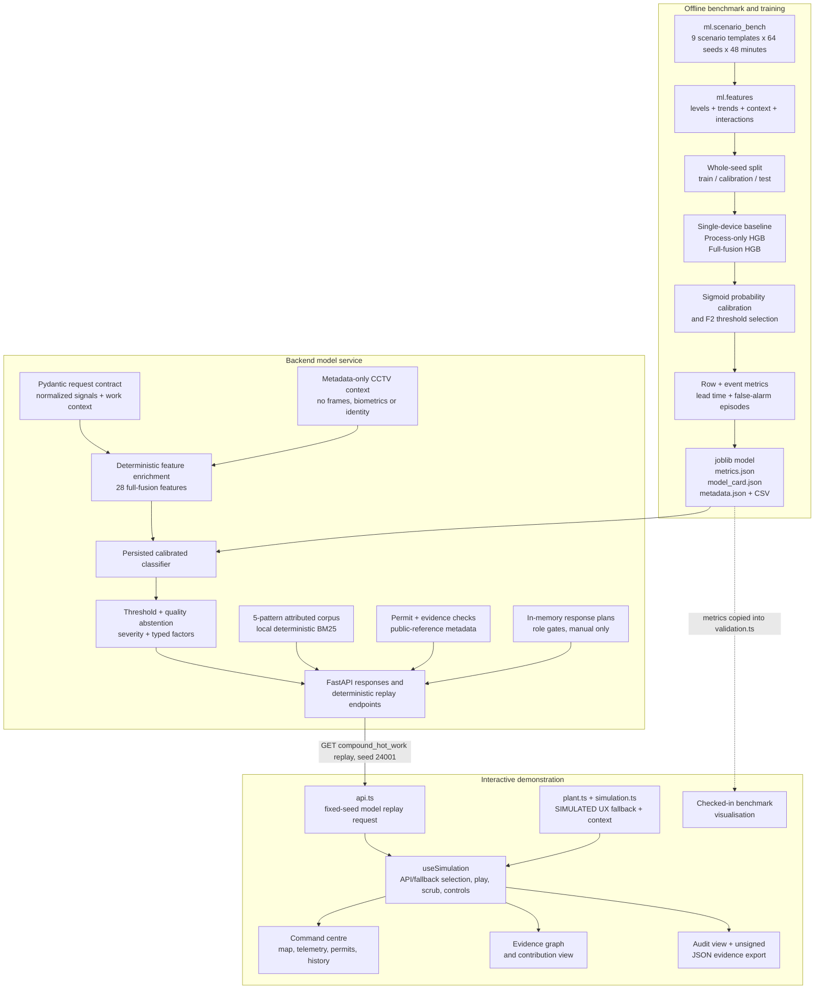
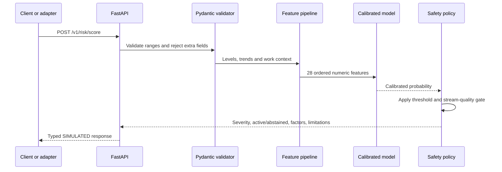
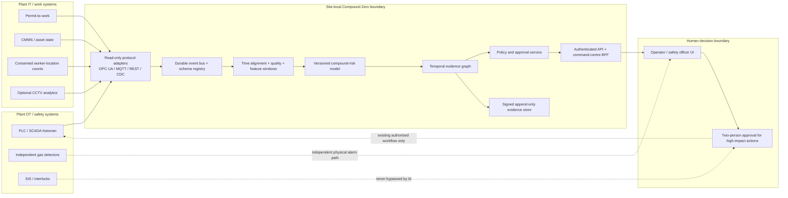

# Compound Zero Architecture

## 1. Design objective

Compound Zero is designed to answer one narrow safety question:

> Can individually non-critical process and work-context signals form an actionable compound-risk case before a conventional single-device alarm fires?

The prototype separates the **risk decision path** from explanation and presentation. Numeric inference is reproducible and has no language-model dependency. Human-facing evidence and proposed controls sit downstream of the score.

## 2. Current repository architecture

The repository currently contains two parallel, inspectable execution paths.

### Important integration boundary

The React interface fetches `/v1/scenarios/compound_hot_work/replay?seed=24001` once on startup. When that succeeds, the persisted model supplies per-minute probability, score, active prediction, device-alarm state, harmful/event state, normalized sensor values/slopes and structured factors. The UI shows the model version and an **API** engine indicator. On fetch failure it uses a visibly labelled deterministic **UX fallback**.

The integration remains bounded. Worker/permit animation, zone-risk rendering, projected intervention reductions and audit records are computed in `apps/web/src/lib/simulation.ts`; a control click does not ask the backend to recompute the counterfactual. The Validation view reads checked-in constants copied from `artifacts/metrics.json`, not `/v1/benchmark`. The browser does not yet stream live windows or call `/v1/risk/score`. A production or pilot build must use signed model/input receipts and one server-side counterfactual policy.

## 3. Offline model flow

### 3.1 ScenarioBench

`ml/scenario_bench.py` creates 576 grouped replays:

- 9 scenario types.
- 64 deterministic seeds, starting at 1000.
- 48 one-minute rows per replay.
- 27,648 total rows.
- A 12-minute forecast target, `risk_within_horizon`.

The scenario suite contains normal shifts, isolated sensor spikes, process drift, sub-threshold drift, permit-only activity, compound hot work, compound confined space, handover overlap and barrier loss with worker exposure.

All schedules, harmful-state equations and values are authored simulation. They are useful for controlled ablation and deterministic regression tests, but do not approximate the full distribution of a real plant.

### 3.2 Feature contract

The online and training paths share `ml/features.py`.

| Feature family | Inputs |
|---|---|
| Sensor levels | Normalized LEL, H2S, CO, oxygen deficit and pressure ratios |
| Sensor trends | One slope per level channel |
| Derived process | Gas burden, maximum threshold ratio, mean positive slope, correlated rise |
| Work context | Ventilation impairment, hot work, confined space, workers in zone, nearest-worker distance, shift handover, permit overlap, isolation, stream quality |
| Interactions | Hot-work × gas, worker × gas, confined-space × oxygen, barrier × gas, handover × permit overlap |

Ratios are relative to site-configured device thresholds. The model therefore does not embed a universal legal exposure limit.

### 3.3 Leakage control and calibration

Whole seeds, rather than shuffled rows, are assigned by `seed mod 5`:

- Test: remainder `0` — 13 seeds / 5,616 rows.
- Calibration: remainder `1` — 13 seeds / 5,616 rows.
- Train: remainders `2`, `3`, `4` — 38 seeds / 16,416 rows.

No seed overlaps partitions. Histogram gradient-boosting classifiers are trained on the train partition. `CalibratedClassifierCV` performs sigmoid calibration on the calibration partition. An F2-weighted decision threshold is also selected on calibration data only; the test partition remains untouched until final evaluation.

### 3.4 Baselines

Three methods are persisted in the metrics artifact:

1. **Single sensor:** fixed alarm when any normalized sensor level reaches `1.0`.
2. **Process only:** calibrated model over levels, slopes and derived process features.
3. **Full fusion:** calibrated model over process, work context and interaction features.

Event evaluation counts the first eligible alert per replay, warning lead relative to the authored event minute, detection before the single-device baseline, and false-alarm episodes on non-event replays. Row metrics include precision, recall, F1/F2, false-negative/positive rates, average precision, ROC AUC, Brier score and confusion matrix.

## 4. Online inference flow

If `stream_quality < 0.80`, the service still returns the score for inspection but sets `abstained=true` and `prediction_active=false`. The caller is instructed to escalate for manual review. This prototype policy must be replaced by site-specific data-quality contracts before a pilot.

The current factor list is a deterministic ranking of engineered interaction values. It is not SHAP, a causal estimate, or a natural-language model explanation.

### 4.1 Privacy-preserving CCTV context

`POST /v1/risk/score-with-cctv` accepts **analytics metadata only**: timestamp, camera/zone reference, bounded event type, anonymous entity count, optional minimum hazard distance and confidence. Its schema fixes `raw_media_included`, `biometric_processing` and `identity_tracking` to `false`; incompatible payloads are rejected.

Only fresh observations from the target zone are used. Across cameras, people counts are combined by maximum rather than sum to reduce double counting without cross-camera identity tracking. The derived worker count, minimum distance and observation confidence update the normal numeric scoring inputs. This is a tested interface for an upstream authorized CV adapter—not an implemented video decoder or CV model. All bundled observations are simulated.

### 4.2 Incident-pattern retrieval

`GET /v1/intelligence/corpus` exposes the corpus version, SHA-256 and source IDs. `POST /v1/intelligence/patterns` runs deterministic local BM25 over five project-authored patterns and returns matched terms, review prompts and source metadata.

The corpus contains public legislation/government links and OISD catalogue/access metadata, not paid normative text. No embedding model, vector database or generative model is used. A no-match query returns an empty list rather than an invented answer.

### 4.3 Permit/evidence audit

`POST /v1/audit/permits` performs deterministic checks over a supplied permit, current context and evidence manifest. Checks include validity, approval/gas-test/attendant evidence, prototype hot-work and confined-space review triggers, overlap during handover, isolation confirmation and blocked-egress metadata. Findings cite the relevant supplied evidence and public-reference metadata; the response includes a canonical SHA-256 evidence-manifest receipt.

This is a bounded analytic checklist. Its 0.35 LEL-ratio and 30-minute gas-test review window are explicitly prototype heuristics, not statutory thresholds. The endpoint always states that it is not a legal determination, certification or safe-work authorization.

### 4.4 Human-gated response plans

`POST /v1/response/plans` creates an in-memory record with required roles based on requested action consequence. Area controls add an Area Authority; evacuation or shutdown requires Area Authority, Safety Officer and Incident Commander. Each role can decide once; rejection or completion locks the plan. A completed plan becomes only `AUTHORIZED_FOR_MANUAL_EXECUTION`.

The store contains no actuator client and always reports `actuation_performed=false` and `autonomous_shutdown_or_evacuation=false`. It is thread-safe but ephemeral, unauthenticated and process-local, so approver references are demonstration inputs rather than verified identities.

## 5. Browser demonstration flow

`useSimulation` advances or scrubs a 48-minute client-side replay. Each tick derives:

- Process readings and configured device-alarm states.
- Permit status, workers and zone risks.
- Compound score, severity, evidence factors and projected control effects.
- A demonstration audit timeline.

Four product views consume this state:

| View | Purpose |
|---|---|
| Command | Operating picture, map, replay controls, risk case, telemetry, permits and response studio |
| Evidence | Typed graph, ranked factors, traces and simulated source provenance |
| Validation | Exact checked-in ScenarioBench ablation metrics and split disclosure |
| Safety Case | Human-control policy, standards metadata, audit timeline and JSON export |

The current map is an SVG plant-layout illustration, not a GIS connector or plume model. Worker coordinates, badges, source freshness and provenance hashes are simulated presentation records.

Separately, `ml/geospatial_bench.py` implements a deterministic **SIMULATED** geometry contract over fictional site-local Cartesian metres: validated plant-zone polygons, boundary-inclusive point-in-polygon, nearest authored hazard-point distance, and conservative exposure classification from a declared isotropic localization-error bound. `artifacts/geospatial_metrics.json` is regenerated with `python -m ml.geospatial_bench`; it includes case/layout SHA-256 receipts and both a point-estimate baseline and uncertainty-aware review result. The benchmark is deliberately boundary-heavy software-conformance evidence. It contains no surveyed coordinates, gas-dispersion or plume physics, probabilistic confidence claim, localization gateway, or field-performance result, and it is not yet wired into the browser map.

## 6. Deployment target for a site pilot

The following diagram is a **proposed deployment**, not current repository functionality.

### Safety partitioning

- Ingest OT signals read-only wherever possible.
- Keep gas detectors, alarms, SIS logic and emergency procedures independent of Compound Zero availability.
- Do not expose a general actuator endpoint from the model service.
- Route reversible workflow changes through explicit policy and operator approval.
- Require dual authorization and the site's existing control system for process isolation or shutdown.
- Run inference and evidence retention inside the plant boundary unless the owner authorizes an outbound aggregate.

## 7. Scalability plan

Scalability is primarily an interface and operations problem, not a reason to centralize plant control.

### Within one site

- Partition event streams by area/unit and preserve per-source ordering.
- Compute feature windows incrementally rather than rescoring full histories.
- Keep inference services stateless around a versioned local model; store evidence separately.
- Apply back-pressure and per-stream freshness contracts; abstain on incomplete critical context.
- Scale read-only replay, reporting and UI services independently from inference.

### Across sites

- Deploy one isolated inference boundary per site, with site-specific thresholds, approved feature mappings and model versions.
- Publish only authorized aggregate health, drift and model receipts to a fleet control plane.
- Never assume that one site's calibration transfers to a different process, sensor layout or work practice.
- Promote models through signed registries and staged shadow/canary gates, with an immediate rollback path.

### Model operations

- Monitor feature freshness, missingness, drift, calibration, false-alarm burden and operator dispositions.
- Preserve replayable input windows and immutable model/configuration receipts for each alert.
- Require a new site-held evaluation and safety review for every material sensor, process or policy change.
- Treat an out-of-distribution operating mode as an abstention condition, not a low-risk state.

No throughput, availability or latency benchmark has yet been run, so the prototype makes no scale-performance claim.

## 8. Planned integration increments

1. Extend the existing fixed-seed replay integration to live windowed `/v1/risk/score` calls, backend-scored counterfactuals and complete model/input receipts on every screen.
2. Add one read-only historian adapter and one permit/CMMS adapter against authorized test systems.
3. Implement event-time alignment, missingness policy and persisted input windows.
4. Extend the existing canonical evidence-manifest SHA-256 and UI display chain to signed, durable append-only records with trusted timestamps.
5. Replace in-memory approver references with authenticated roles, durable approval policy, audit retrieval and incident-export redaction.
6. Run a shadow-mode site pilot with local safety engineering, calibration and hazard review.
7. Connect the metadata-only CCTV boundary or expand retrieval only when an authorized dataset/corpus, lawful purpose and separate evaluation are available.

## 9. Architecture decision records

| Decision | Rationale | Cost |
|---|---|---|
| No LLM in risk decisions | Numeric, reproducible and testable safety path | Less flexible narrative reasoning |
| Separate calibration partition | Prevent test leakage and expose probability quality | More data required |
| Whole-seed split | Prevent adjacent windows from one replay crossing partitions | Harder, more honest test |
| Explicit SIMULATED classification | Prevent demo results being mistaken for field evidence | Repeated disclosure in UI/API/docs |
| Human-gated dry-run controls | Avoid prototype actuation risk | No end-to-end plant automation claim |
| Site-local target architecture | Reduces OT exposure and data egress | Per-site deployment and maintenance |

See [requirements traceability](requirements-traceability.md) for brief coverage and [security and safety](security-safety.md) for the production gate.
