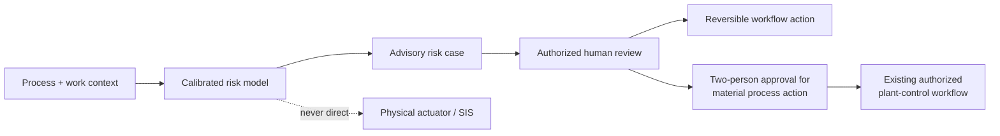

# Security and Safety Case

## 1. Safety position

Compound Zero is a **decision-support prototype**. It does not replace gas detectors, alarms, safety-instrumented systems (SIS), emergency procedures, permit authority, or operator judgement.

The current repository has no actuator endpoint. Web controls are deterministic dry-run state changes in the browser; API response-plan approval changes only an ephemeral record to `AUTHORIZED_FOR_MANUAL_EXECUTION`. A failure, false negative or outage of Compound Zero must never suppress an existing physical alarm or interlock.

## 2. Decision authority

| Action class | Prototype behavior | Production policy target |
|---|---|---|
| Display, alert and notify | Visual advisory only | May be automated if channels and escalation are approved |
| Permit hold | Browser dry run | Authenticated permit authority; explicit confirmation; reversible audit receipt |
| Worker evacuation | Browser animation only | Authorized emergency procedure and accountable incident commander |
| Process/fuel isolation | Browser projection only | Dual authorization through the existing control system; no direct model actuation |
| Shutdown/interlock | Not present | Remains in SIS/operations authority; AI may advise but cannot bypass safety logic |

## 3. Language-model boundary

No language model participates in feature generation, scoring, thresholding, severity, replay or structured risk-factor selection. The Python dependency set contains no LLM SDK, and the API reports `llm_in_risk_path: false`.

The implemented incident-pattern service is deterministic local BM25 retrieval over five cited, project-authored patterns; it uses no generator. Generative incident/regulatory RAG is not implemented. If a language model is added later, it may only:

- Retrieve and summarize authorized documents with line-level citations.
- Draft a clearly labelled advisory or preliminary report for human review.
- Translate an already-computed numeric risk receipt into plain language.

It must never:

- Invent, modify or override a sensor value, threshold, risk probability or safety rule.
- Determine regulatory compliance or certification.
- Authorize an evacuation, permit change, isolation, shutdown or interlock.
- Continue silently when retrieval is missing, contradictory or outside its authorized corpus.

## 4. Implemented safety controls

| Control | Implementation | Verification |
|---|---|---|
| Explicit simulation classification | Dataset metadata, model card, API schema/response, replay response and UI disclosures use `SIMULATED` | Backend tests assert the classification |
| Strict request contract | Pydantic ranges each input and forbids extra fields | Invalid fields/ranges receive validation errors |
| Poor-stream abstention | `stream_quality < 0.80` sets `abstained=true` and `prediction_active=false` | API test covers a sub-threshold compound case with bad quality |
| Independent single-device baseline | `single_sensor_alarm` is computed separately from the model | Scenario and API tests check pre-threshold detection and isolated-spike behavior |
| No actuator API | Response mutations change only an in-memory plan; no route invokes equipment, access control, notification or emergency systems | Inspect `services/api/main.py` and `response_store.py` |
| Human-gated UI language | Response Studio says dry-run and requires an operator click | Browser state only; not an identity-backed approval |
| Metadata-only CCTV boundary | Schema rejects raw media, biometrics and identity tracking; only recent same-zone anonymous events affect worker count/distance/quality | Backend tests cover fusion and forbidden payloads; no CV model is included |
| Non-generative cited retrieval | Local BM25 returns matched terms, public source metadata and corpus SHA; nonsense queries return no match | Backend tests assert ranking, citations, no generator and empty no-match behavior |
| Bounded permit checks | Deterministic findings reference supplied evidence and public metadata, label heuristics, and deny legal/certification authority | Backend tests cover critical and no-finding cases |
| Role-gated response records | Required human roles depend on action impact; terminal records lock; actuation flags remain false | Backend test completes three-role high-consequence approval and confirms no actuation |
| Reproducible model receipt | Model version, decision threshold, feature list and dataset SHA are returned | `/v1/model` |
| Published robustness diagnostics | Scenario-type holdouts and frozen-model missing/noise stresses expose current transfer and alert-load failures instead of hiding them behind the base result | `artifacts/robustness_metrics.json`; backend tests verify protocol and checked-in artifact |
| Safe-use limitations | API and model card prohibit field-performance, autonomous-control and certification claims | `artifacts/model_card.json` |

### Abstention is necessary but incomplete

The prototype abstains only on a scalar `stream_quality` input. It does not independently calculate freshness, detect frozen sensors, validate clock alignment, recognize maintenance bypasses, detect out-of-distribution operation, or distinguish a malicious quality value. Production quality gates must be derived from source receipts and per-signal policy, not trusted from a caller-provided number.

The simulated stress suite shows why that distinction matters. Removing either the process-sensor stream or the barrier-and-shift stream reduces event recall from 65/65 to 52/65. Gaussian `σ=0.05` sensor noise preserves event recall but raises false-alarm episodes from 1.15 to 47.88 per simulated 24 hours. These neutral-value substitutions and authored noise are diagnostics, not a safe production degradation strategy. Missing critical inputs must produce an explicit policy-driven degraded or abstained state.

## 5. Current security posture

The current application is appropriate for local demonstration with simulated data, not for connection to an operational network.

| Area | Current state | Production requirement |
|---|---|---|
| Authentication and authorization | None | SSO/service identity, least-privilege RBAC/ABAC, separation of operator/approver/auditor roles |
| Transport security | Local HTTP | Mutual TLS for service traffic; managed certificates; encryption in transit |
| Network boundary | API binds to `127.0.0.1`; browser dev origins are allow-listed by CORS | OT/IT segmentation, read-only DMZ adapters, egress policy and firewall review. CORS is not access control |
| Secrets | None required for bundled simulation | Site secret manager, rotation, no secrets in logs or browser bundles |
| Persistence | Static artifacts, browser state, downloaded JSON and process-local in-memory response plans | Encrypted durable store, retention/deletion policy, backup and recovery |
| Audit integrity | UI display chain/unsigned JSON; permit audit returns a canonical evidence-manifest SHA-256 | Durable canonical chain, trusted timestamps, digital signatures, key rotation and independent verification |
| Supply chain | Locked JavaScript dependency graph; broad Python version ranges | Dependency/SBOM scan, pinned reviewed releases, signed builds and artifact provenance |
| Abuse/rate limiting | None | Authentication, request quotas, body limits, timeouts and anomaly monitoring |
| Availability | Single local process | Health/readiness, redundancy, bounded queues, degraded modes and tested recovery |
| Model integrity | Local joblib file | Signed model registry, hash verification before deserialization, restricted write access and rollback |

### Audit-integrity caveat

The UI's `shortHash` helper creates a short, non-cryptographic demo link sequence. Events are regenerated from client state, not written to a durable ledger, and the downloaded JSON pack is unsigned. The interface explicitly labels the link check and states that a tamper-proof ledger is not implemented. Separately, the permit-audit endpoint computes a real SHA-256 over canonicalized supplied evidence, but that receipt is neither signed nor durably stored. Production integrity claims require a verifiable implementation and adversarial tests.

### Serialized-model caveat

`joblib.load` can execute code from a malicious serialized artifact. Only load a model produced by the trusted training pipeline from a write-restricted, hash-verified store. Never accept an uploaded joblib file from an untrusted source.

## 6. Threat model

### Protected assets

- Process telemetry, operating modes and plant topology.
- Permit, maintenance and shift records.
- Worker-location data and any identity mapping.
- Model artifacts, thresholds and configuration.
- Operator decisions, approvals and incident evidence.
- Availability of the independent safety and control environment.

### Principal threats and required mitigations

| Threat | Safety/security impact | Required mitigation before pilot |
|---|---|---|
| Spoofed or replayed telemetry | False reassurance or nuisance intervention | Source identity, sequence/time validation, anti-replay, historian reconciliation, sensor diversity |
| Missing/stale context | Compound risk is understated | Per-source freshness budgets, explicit missingness, abstention, visible degraded mode |
| Unseen operating/risk family | False reassurance under distribution shift; the simulated held-out `process_drift` fold currently detects 0/64 events | Per-mode data coverage, out-of-distribution review, local recalibration, time/scenario holdouts and prospective shadow validation |
| Clock skew/event mis-ordering | Incorrect interaction windows | Trusted time, event-time processing, bounded lateness and replayable correction |
| Model/config tampering | Altered scores or thresholds | Signed releases, hash verification, write separation, dual approval for configuration |
| Poisoned training data | Systematic unsafe model behavior | Provenance manifest, immutable raw zone, review, anomaly checks and isolated evaluation |
| Unauthorized operator action | Unsafe permit/process change | Strong identity, least privilege, step-up authentication and dual control |
| Worker surveillance misuse | Privacy, labor and legal harm | Purpose limitation, consent/consultation, pseudonymization, aggregation and short retention |
| Evidence deletion or editing | Failed investigation/accountability | Append-only signed storage, independent replication and retention holds |
| Denial of service | Loss of advisory coverage | Independent alarms, queue isolation, local degraded mode and tested recovery |
| Prompt/document injection in future RAG | Misleading procedural guidance | Corpus allow-list, content isolation, citation verification, no tool/action authority |

## 7. Privacy and worker data

The demo uses static pseudonymous labels such as `W-118`; no real person data is bundled. Production worker location is still sensitive even when names are removed.

Minimum privacy controls:

- Establish a documented safety purpose and lawful basis before collecting location.
- Prefer anonymous zone counts over individual identity whenever the safety decision permits it.
- Keep the identity mapping outside the model service; reveal it only to authorized responders during an active need.
- Use coarse, short-lived location for live protection; avoid productivity scoring and unrelated retrospective surveillance.
- Define retention, access, worker notice, correction and deletion processes.
- Redact identifiers from evidence exports by default and log every re-identification.
- Evaluate badge accuracy and missing-badge behavior; “not observed” must never be interpreted as “no worker present.”

The CCTV request contract does enforce metadata-only input and rejects raw-media/biometric/identity flags. It does not establish lawful collection upstream. No consent store, verified identity separation, retention enforcement or export-redaction pipeline is implemented yet.

## 8. Functional-safety operating rules

1. **Advisory only until validated.** Run in shadow mode; do not drive process control.
2. **No silent failure.** Missing critical context creates a degraded/abstained state that is visible to operators.
3. **No replacement claim.** Physical alarms, permit rules, HAZOP/LOPA controls and SIS remain authoritative.
4. **Site-specific calibration.** Thresholds and model performance must be evaluated for each unit and operating envelope.
5. **Conservative change control.** Sensor, feature, model or policy changes require replay, approval, versioning and rollback.
6. **Measure operator outcomes.** Track accepted/dismissed alerts, false-alarm burden, missed events and time to safe disposition.
7. **Test dangerous disagreement.** Exercise cases where AI and conventional alarms disagree, including an AI-low/device-high condition.
8. **Fail closed on authority.** If identity, policy or approval state is unavailable, no consequential action is issued.
9. **Treat robustness failures as gates.** The base 65/65 simulated holdout cannot override the 256/320 pooled scenario-type result or the 0/64 held-out `process_drift` miss.

## 9. Compliance boundary

The UI maps evidence concepts to public metadata for:

- [OISD-STD-105 in the OISD standards catalogue](https://www.oisd.gov.in/en-in/oisd-standards-list).
- [Occupational Safety, Health and Working Conditions Code, 2020](https://labour.gov.in/sites/default/files/osh_gazette.pdf), in force from 21 November 2025 under [S.O. 5321(E)](https://labour.gov.in/sites/default/files/e-noti-osh-1.pdf). Section 143 repeals the Factories Act, 1948 subject to savings for prior rules and actions.
- [ISO 45001:2018 overview](https://www.iso.org/standard/63787.html).

This mapping is not a control assessment, legal opinion, certification or statement of conformity. Current OISD normative text is sold through authorized access; the repository does not bundle it. DGMS applicability depends on site and sector. A qualified owner must establish the applicable legal/standards register and validate every control using authorized current text.

## 10. Pilot security and safety gate

Do not connect Compound Zero to plant systems until:

- A plant owner has approved the use case, data flows and network zones.
- A hazard analysis establishes that failures cannot defeat existing protection layers.
- Connectors are read-only or physically/policy constrained, authenticated and tested under loss/replay/skew.
- The model is evaluated on authorized local data with calibrated uncertainty and documented limits.
- The published unseen-`process_drift` miss is resolved on representative authorized scenarios, and missing/noisy-stream behavior meets a jointly approved alert-load and false-negative acceptance plan.
- Identity, role separation, approval and break-glass behavior are tested.
- The evidence store is durable, signed, redacted and independently verifiable.
- Cybersecurity, privacy, safety, legal and operations owners approve the deployment and rollback plan.
- Tabletop and failover exercises demonstrate a safe degraded mode.

See [architecture.md](architecture.md) for the target deployment and [runbook.md](runbook.md) for local prototype operation.
